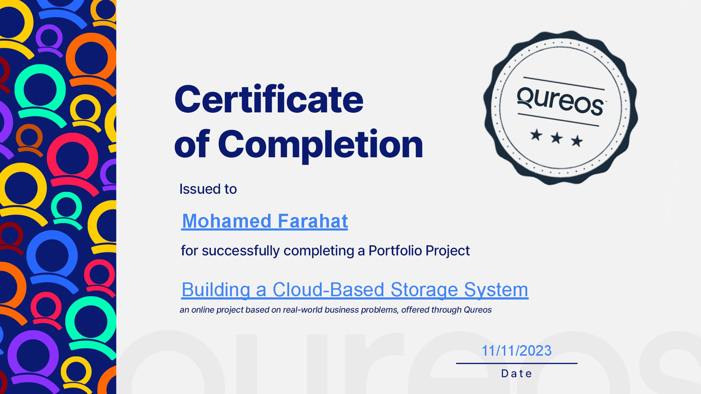

# Accenture-Cloud-Based-Storage-System

A project for Accenture company hosted by Qureos platform.
Welcome to the Accenture Cloud-Based Storage System repository! This Data Engineering project for Accenture company hosted by Qureos platform encompasses the design, implementation, and security of a scalable cloud-based storage system hosted on AWS. The system is tailored to meet the storage needs of Accenture, ensuring robust security, efficient file management, and seamless scalability.

> <p align="center">
>   
> </p>

## Objectives

The objective of this project is to assess the technical skills of potential Engineers for Accenture, a leading global IT services company. The assessment was conducted through three deliverables:

- Designing a system architecture.
- Implementing backend services for file management.
- Ensuring data security.
  The outcome was to determine if applicants meet the necessary criteria for the role, including cloud computing skills, backend development abilities, and a strong understanding of data security.

## Compnay Overview

Accenture plc is an **Irish-American professional services company based in Dublin, specializing in information technology (IT) services and consulting.** A Fortune Global 500 company, it reported revenues of $61.6 billion in 2022.

> You can visit them [here](https://www.accenture.com/us-en).

## Repository Structure

- **Task01_AWS_system_diagram**: Contains the comprehensive system architecture diagram and design decisions for the cloud-based storage system. Check the [Task01_AWS_system_diagram README](./Task01_AWS_system_diagram/README.md) for detailed information.

- **Task02_backend_services**: Hosts the backend services implementation, providing RESTful APIs for file management. This includes functionalities for file uploads, downloads, and sharing. Explore the [Task02_backend_services README](./Task02_backend_services/README.md) for the backend service details.

- **Task03_data_security**: Focuses on implementing robust security measures for the cloud-based storage system. This includes file encryption, secure data transmission, user authentication, and access controls. Refer to the [Task03_data_security README](./Task03_data_security/README.md) for an in-depth look at the security measures.

## Getting Started

To get started with the Accenture Cloud-Based Storage System, follow these steps:

1. **Clone the Repository:**
   ```bash
   git clone https://github.com/Farahat12/accenture-cloud-storage-system.git
   cd accenture-cloud-storage-system
   ```
2. **Explore Each Task:**

   - Review the README documentation in each task directory for detailed insights into the system architecture, backend services, and security measures.

3. **Setup and Run the System:**
   - Follow the instructions provided in each task's README to set up and run the system locally.

## Contributions

I welcome contributions to enhance and improve the Accenture Cloud-Based Storage System. If you have suggestions, find issues, or want to contribute new features, please open an [issue](https://github.com/Farahat12/accenture-cloud-storage-system/issues) or submit a pull request.

## License

This project is licensed under the [MIT License](./LICENSE). Feel free to use, modify, and distribute the code as per the license terms.
